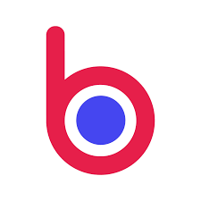

<h1 align="left" id="macropower-title">Olá, sou Davi Jedrzejczyk! </h1>

<b>👀Buscando novas oportunidades para expandir minha experiência e contribuir com projetos desafiadores.👀</b>

Estou sempre atualizando meus projetos e buscando evoluir minhas habilidades, especialmente na área de desenvolvimento de software com boas práticas e arquitetura limpa!

<h2 align="left" id="macropower-tech">Tecnologias Favoritas💻</h2>

> Ferramentas, linguagens, entre outras coisas que eu gosto de trabalhar.

  <!-- For more icons please follow  https://github.com/MikeCodesDotNET/ColoredBadges -->
  
      
  
  
  

<h2 align="left">Coding Activity👾</h2>

> Estatátisticas sobre o meu perfil.

  
  

<h2>Experiências💼</h2>

  
<h3></h3>

    
<b>Cargo: Programador Trainee</b>

    
Trabalhei na Benner em 2023 a 2024. Com o C# sendo a principal linguagem usávamos o .NET Framework 4.7.8 para desenovlvimento WEB, e com Delphi 10 usado para desenovlvimento do sistema desktop. Comecei com pair-programming para adaptação e depois de 3 meses comecei atuar solo e tive grandes resultados passando pelo periodo de experiência e pelos 6 meses de apadrinhado. Sobre questão de arquitetura pude aprender muito conversando com arquitetos e estudando sobre a própria arquitetura da Benner, o sistema que atuei era monolítico, apliquei padrões como SOLID, TDD e DDD. A empresa valoriza uma base forte de Clean Code, utilizando ferramentas como SonarQube para garantir a qualidade do código e revisões rigorosas de Merge Requests (MRs), utilizando o Jenkins.
    

  
<h3></h3>

    
<b>Cargo: Estágiario</b>

    

      Estagiei por 3 meses na Senior Sistemas, onde participei de um programa de capacitação para concorrer a vagas dentro da Senior. Nesse tempo tive a oportunidade de crescer e experenciar como funciona os processos de desenvolvimento e como aplica-los a modo Senior de ser, criando projetos do zero e entendendo melhor as tecnologias de mercado e principalmente tecnologias próprias da Senior. Utilzando do Java como principal linguagem, não houve problema em adaptação para essa stack. Por esse breve momento pude aprender como funciona microsserviços que a Senior optou por utilizar em seus sistemas, e assim como em outra experiência utilizam muito do TDD e DDD para o desenvolvimento, para o TDD foi utilizado a tecnologia mais comum do mercado JUnit, e para manter o padrão DDD utilizávamos tecnologias da Senior assim o código gerado nos fazia ter uma arquitetura muito bem padronizada e mantendo o MVC (Model-View-Controller) na construção das APIs. Fomos desafiados a fazer projetos inovadores, cada um com sua ideia e encorajados a por em prática com as tecnologias da Senior. Para termos uma boa interface nas apresentações usávamos do Angular na sua versão 9, que era a versão compátivel com o FrontEnd Generator da Senior, por mais que seja um gerador de códigos isso ainda nos possibilitava de moldar e construir os nossos códigos a forma que quiséssemos.  
    

<h2 align="center">Contatos e Sites</h1>

  &nbsp;&nbsp;
  &nbsp;&nbsp;
  &nbsp;&nbsp;

  

